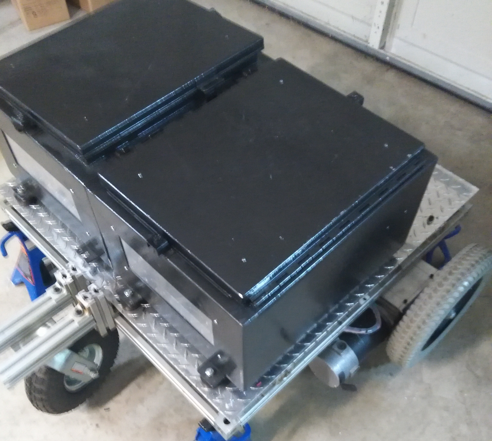
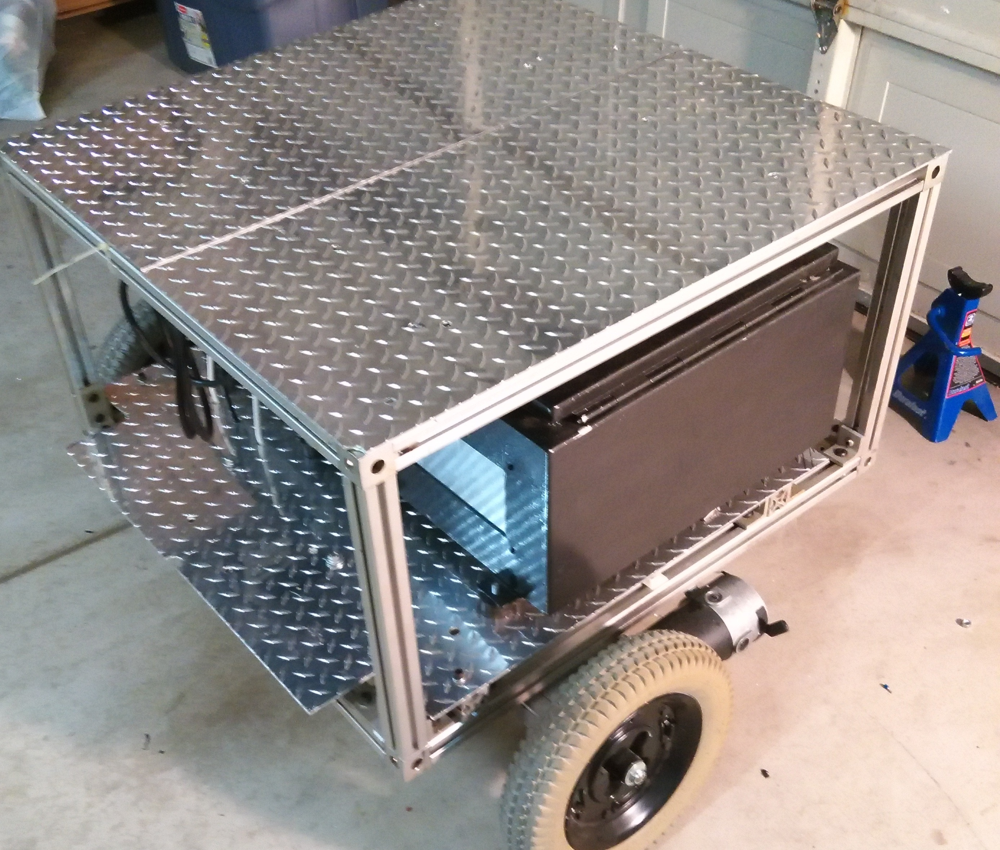
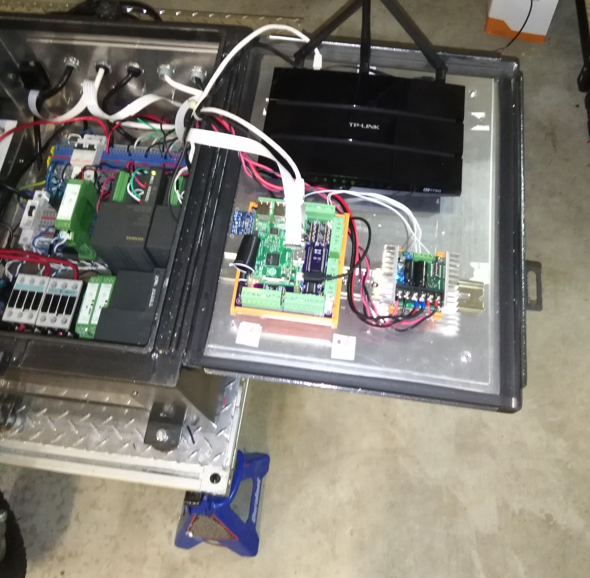

# MDRobot
Design files for Metal Detecting Robot

The MD Detecting Robot is a robotic platform that is designed to tow a metal detector coil array and scan an open area either automatically or manually.  Towing the coil allows the detection circuitry to not detect off the metal of the robot itself.  The robot can either autonomously "scan" a field, or can be teleoperated for manual operation.  Various patterns such as back and forth, or circular spiral patterns are possible.  The platform can be also used for general purpose robotics development.

Robot without top frame

Robot with Top frame and shelf

The MD Robot has several major components in the overall system, with space designed in to add several more if needed. 

The first major component is the power distribution system.  The robot is powered from dual 12V, 35ah batteries with a 600W sinewave inverter.  The battery's directly power the motor amplifier board, a dual 2X25 Sabertooth amplifier.  The inverter powers the controls, which include 5V for the various SBC boards such as the Raspberry Pis, the 12V which powers the WIFI router, 24V which powers the contactors and brakes, and +/- 15V which powers the current sensors and metal detector circuitry.

Robot with both lids open showing batteries, power supplies, etc.

The second major component is the main on-board supervisory control system comprised of a high-level Windows PC running Azure, with a SQL server historian, and several smaller Linux-based supervisory controllers running on Raspberry Pi SBCs.  The Main Raspberry Pi SBC will host an industrial softPLC software runtime from Codesys.  The Pi interfaces to a baseboard via I2C which houses a Teensy 3.1 microcontroller, a 10 DOF IMU from Adafruit, and a 4ch I2C based DAC, and is shown in several pictures here.

Debugging Huzzah module in Codesys

The on-board Teensy drives four solid state relays, and has four 12bit A/D channels with buffering provided on the base board.  The Teensy is also utilizing the Teensy's real-time clock capability, and passes this clock data back to the Pi.  The solid state relays drive the ESTOP circuit and the brakes on the robot.  The 4ch DAC drives the dual analog-controlled Sabertooth motor amplifier.  

For video, the Pi utilizes a 5MP Pi Camera to provide streaming video embedded inside the Pi's web browser GUI.  The Pi's web browser GUI can be controlled remotely from additional computers on the network, and can also be recorded using standard desktop recording software such as FRAPS or Camtasia.  

Robot control via web page with Codesys GUI

Eventually, a high level Windows PC will host a Azure based GUI, and will be interfaced to the main supervisory Pi via Modbus TCP. Control and operator interaction with the Azure GUI will be from a remote laptop via a VNC client/server connection, if needed.  This PC will also host the Kinect interface, the Flowstone Audio susbsystem, and the Unreal engine based 3D virtual world interface.  The eventual goal is to control the system through the 3D virtual world interface.  An additional Pi will be used in conjunction with a RoboPi daughterboard.  This board will interface to the Robot's ulrasonic sensors, and main wheel encoder sensors.  This Pi will also run a Codesys runtime, and will provide feedback data from the sensors back to the supervisor Pi.

Raspberry Pi mounted to PLC base board running Codesys v3.58

The third major component is the positioning measuring system, which is comprised of several pieces.  The robot's GPS coordinates are provided by an Adafruit Ultimate GPS Hat board.  In addition to this, the robot wheels will have encoders that can keep limited track of positioning through dead reckoning.  A beacon system, located at three corners of the area to be scanned, will provide triangulation of the robot as well.  Each beacon will house a Pi with a GPS hat, and will be linked to the robot's Wifi network.  Each beacon will run a Modbus server, and the main supervisory Pi will poll these servers through it's Modbus client.  With the four GPS readings, the IMU, and the wheel encoder feedback, an accurate reading can be derived of position in the scan area.

The fourth major component will be the metal detecting subsystem, which is comprised of detection circuits, a large pulse induction coil, and smaller coils, mounted to a PVC frame, which can be lifted up or down, to facilitate turning or other obstacle related issues.  The frame will be mounted to a PVC pipe arm which is lifted by the action a linear actuator, also controlled from the controller Pi.  The metal detector will use multiple, pulse induction detection circuits, controlled from a master controller, each circuit tuned to the particular coil.  Each coil will be actuated in sequence, to prevent interference with other coils.  This master controller will provide all of the detection feedback to the robot's supervisor controller over a Wifi interface.  Detections from the MD subsystem, will be logged with the dereived GPS coordinates, along with the dead-reckoning and beacon-derived world coordinates.  A color map can be generated from this data, but initially data will be recorded with a waterfall-style recording, similar to that of other scanning systems.  By timestamping the waterfall recording, a metadata file can be generated with all of the other data using the same timestamp.  

Finally, the operator will have several points of control for the system.  A small hand pendant will be used for basic positioning and driving tasks.  This pendant will utilize an ESP8266 Wifi processor based board such as the Adafruit Huzzah coupled with e Teensy 3.1, or similar.  A dual-axis Joystick along with several buttons, and a LCD readout will provide basic control, as well as the ability to remotely ESTOP the robot in case of emergency.  A laptop connected to the Robot's Wifi network, provides a base station Operator interface, using a VNC connection to the high level Windows PC on the robot.  Eventually, a 3D virtual environment client will be located here, and will access the server.

Example of Codesys Gui

All of the necessary design files for the system, will be available in this repository, including source code, board design files, BOMS, schematics, and other relevant information.

See my blog for more info on the build: http://fixstuff-thots.blogspot.com/

## Credits

Software for this project is in part thanks to the great work of the following teams and individuals:
* Arduino team that develops and maintains versatile [Arduino IDE](https://www.arduino.cc/)
* [adafruit](https://www.adafruit.com/) providing several of the Codesys device files, and the source of wonderful hardware like the Ultimate GPS Hat (only one of numerous examples of open software adafruit contributes to community) 
* Dan Mandle http://www.danmandle.com/blog/getting-gpsd-to-work-with-python/ for his python script to work with GPSd daemon.
* GPSd daemon team - http://www.catb.org/gpsd/
* 3S Smart Software Systems for Codesys - Thanks for providing Codesys on the Raspberry Pi! - https://www.codesys.com/
* Raspberry Pi foundation for the wonderful Raspberry Pi - https://www.raspberrypi.org/
* Paul Stoffregen and PJRC.com for the wonderful Teensy 3.1 development board - https://www.pjrc.com/teensy/teensy31.html
* Pymodbus library team at https://pymodbus.readthedocs.org/en/latest/#* 

